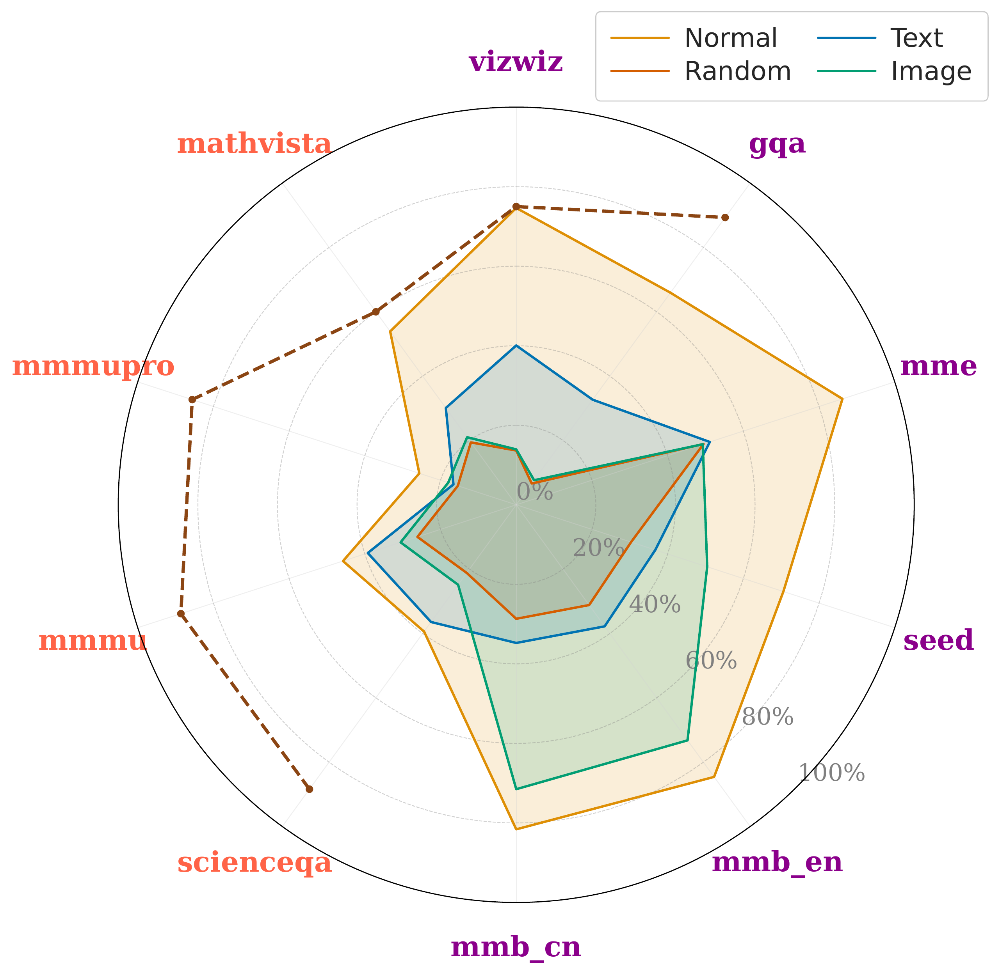
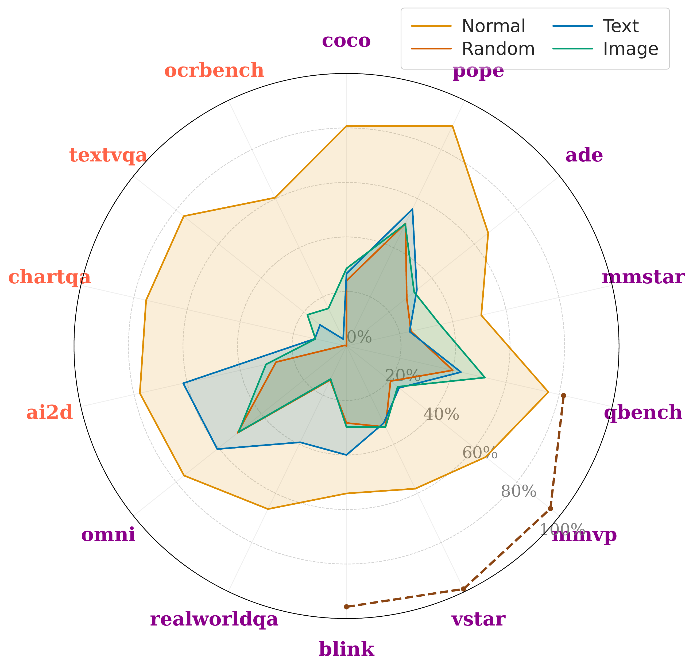

<div align="center">

# Multi-modal Data Spectrum:<br>Multi-modal Datasets are Multi-dimensional

[](https://iclr.cc/)
[](https://arxiv.org/pdf/2509.23499v2)

</div>

**Authors**: [Divyam Madaan](https://dmadaan.com/), [Varshan Muhunthan](https://openreview.net/profile?id=~Varshan_Muhunthan1), [Kyunghyun Cho](https://kyunghyuncho.me/), [Sumit Chopra](https://www.spchopra.net/)

TL;DR: Large-scale empirical analysis showing the varying strength of inter- and intra-modality dependencies across 23 popular VQA benchmarks.


## Abstract
Understanding the interplay between intra-modality dependencies (the contribution of an individual modality to a target task) and inter-modality dependencies (the relationships between modalities and the target task) is fundamental to advancing multi-modal learning. However, the nature of and interaction between these dependencies within current benchmark evaluations remains poorly characterized. In this work, we present a large-scale empirical study to quantify these dependencies across 23 visual question-answering benchmarks using multi-modal large language models (MLLMs) covering domains such as general and expert knowledge reasoning, optical character recognition, and document understanding. Our findings show that the reliance on vision, question (text), and their interaction varies significantly, both across and within benchmarks. We discover that numerous benchmarks intended to mitigate text-only biases have inadvertently amplified image-only dependencies. This characterization persists across model sizes and types, with models often obtaining high performance by using each modality independently and showing limited dependence on their interaction. We provide a quantitative characterization of multi-modal datasets, enabling a principled approach to multi-modal benchmark design and evaluation.

<p align="center">
  
  
</p>

## Getting Started

### Prerequisites

```bash
pip install uv
```

```bash
cd eval
uv venv --python 3.11
source .venv/bin/activate
uv pip install -e ..
uv pip install -r requirements.txt
```

Datasets download automatically when evaluations are run.

### Running evaluations

[test_multimodal_models.sh](eval/test_multimodal_models.sh) runs each benchmark under four conditions (Normal, Text Shuffle, Image Shuffle, Random) and writes `.jsonl` into `eval/answers_<label>/<benchmark>/`. The default model **Cambrian** use two arguments: `<model_size>` and `<benchmarks>` (e.g. `./test_multimodal_models.sh 8b all`). To use another model, pass the model type first: `<model_type> <model_size> <benchmarks>`. Supported models:

- **cambrian** 8b, 13b, 34b: `answers_8b/`, `answers_13b/`, `answers_34b/`
- **qwen2_5** 7b: `answers_qwen2_5_7b/`
- **qwen3** 8b: `answers_qwen3_8b/`
- **llava-next** 7b-mistral: `answers_llava-next_7b-mistral/`

For non-Cambrian models, download checkpoints first with [download_models.sh](eval/download_models.sh) (`./download_models.sh <model_type> <model_size>`).

Run [run_eval.sh](eval/run_eval.sh) to generate benchmark results:

```bash
./run_eval.sh 
```
To generate ensemble and model comparison PDFs and radar plots:

```bash
python compare_model_performance.py --base_dir .
python radar_plot_results.py
```

The following benchmarks are supported:

1. GQA
2. VizWiz
3. ScienceQA
4. TextVQA
5. POPE
6. MME
7. MMBench (en/cn)
8. SEED
9. MMMU
10. MMMU-Pro
11. MathVista
12. AI2D
13. ChartQA
14. OCRBench
15. MMStar
16. RealWorldQA
17. QBench
18. BLINK
19. MMVP
20. VStar
21. ADE
22. OMNI
23. COCO

Each benchmark has an `eval/<name>/` subdir with `*_eval.py` (generate answers) and `*_test.py` (obtains corresponding scores). 

## Contributing

We'd love to accept your contributions to this project. Please feel free to open an issue, or submit a pull request as necessary. If you have implementations of this repository in other ML frameworks, please reach out so we may highlight them here. To add a new benchmark or improve existing ones, follow the structure of the existing benchmark directories. 

## Acknowledgements

The code is based on [Cambrian](https://github.com/cambrian-mllm/cambrian).
We thank the authors for their amazing work and releasing the code base.

## License

This codebase is released under [MIT License](https://github.com/divyam3897/spectrum/blob/main/LICENSE).

## Citation

If you find this paper useful, please consider starring this repo and citing our paper:

```bibtex
@inproceedings{
madaan2026multimodal,
title={Multi-modal Data Spectrum: Multi-modal Datasets are Multi-dimensional},
author={Divyam Madaan and Varshan Muhunthan and Kyunghyun Cho and Sumit Chopra},
booktitle={The Fourteenth International Conference on Learning Representations},
year={2026},
url={https://openreview.net/forum?id=tTGdt3ZKca}
}
```
